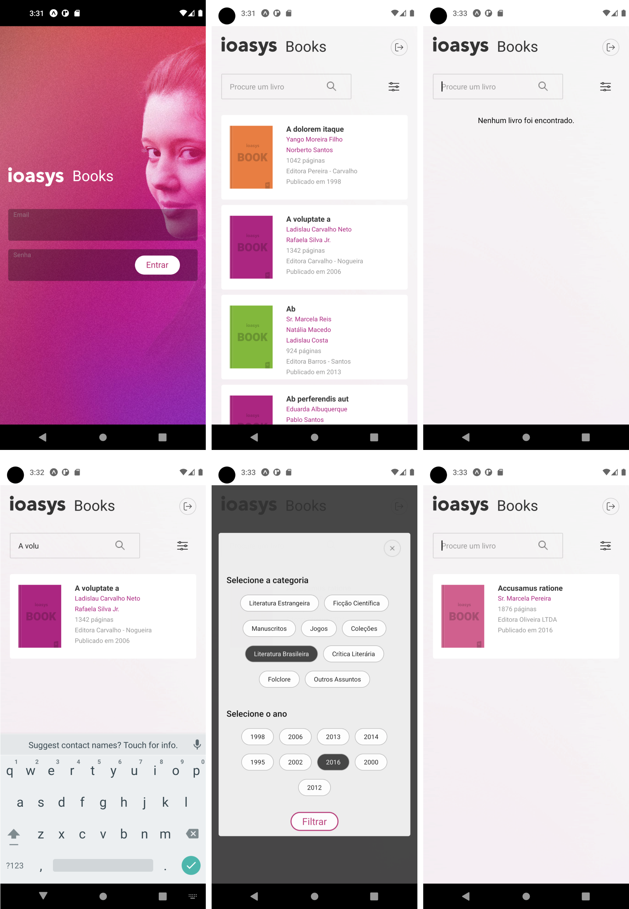

<h1 align="center">
    
</h1>

<h3 align="center">
   <br/><br/>
  Teste de Aplicação Mobile
</h3>

<p align="center">Projeto ioasys Books feito em React Native<br/><br/>A aplicação foi desenvolvida com React Native, TypeScript e Styled Components.JS</p>

<p align="center">
  <a href="#coffee-build-setup">Setup</a>&nbsp;&nbsp;&nbsp;|&nbsp;&nbsp;&nbsp;
  <a href="#iphone-mobile">Mobile</a>&nbsp;&nbsp;&nbsp;|&nbsp;&nbsp;&nbsp;
</p>

<h2>
  
</h2>

### Requisitos

* Utilizar React Native;
* TypesScript;
* Seguir o Layout proposto;
* Integrar API respeitando os contratos de OAuth;
* Git Flow


# :coffee: Build Setup
# :iphone: Mobile

Após clonar o repositório, entre na pasta `ioasys-book` e instale todas as dependências utilizando o comando:
```bash
# Digite o comando abaixo para instalar as dependências:
yarn install
```

Para rodar o App no emulador:
```bash
# Irá iniciar o metro-bundler
yarn start
```
E em outra tela do terminal:
```bash
# Para emular no Android
yarn run android

```
Para emular no IOS:
```bash
yarn run ios
```
<br>

### 🛠 Tecnologias

As seguintes bibliotecas foram usadas na construção do projeto:
- react-native-cli - Utilizei a CLI do React Native com TypeScript Template.
- axios - Para realizar os métodos de chamadas á API.
- styled-components - Lib utilizada para estilizar todo o app.
- Eslint - Linter.
- Prettier - Formatador de códigos, boas práticas de código limpo e organização.
- Husky - Utilitário de melhoramento para commits.

### 🛠 Itens importantes

Adicionei como parte de organização, os "Absolute Paths", que ao invés dos caminhos relativos ao importarmos as bibliotecas do tipo: ```'import Component from '../../../components/Component';``` ficando assim: "import Component from ```'@components/Component';``` Essa é uma prática que já utilizo em meus projetos com o intuito de deixar o código melhor organizado e limpo.

Este desafio foi muito interessante, principalmente na parte de filtragem e de pesquisa no app, utilizei funções que fazem tanto a consulta via input na home inicial, quanto no modal de filtros. Neste modal de filtros, pode se fazer tanto pesquisas por categorias, por ano de publicação ou pode fazer apenas das categorias ou apenas dos anos.
Ao filtrar os dados da api ele retornará aquele que der match com o resultado, caso contrário aparecerá uma mensagem que "Nenhum registro foi encontrado" e um botão para limpar o filtro e retornar a listagem normal.

Utilizei na parte do login e login persistente o async Storage do React Native utilizando um contexto de autenticação para manter o usuário logado no app com o refresh token que a própria API fornece.

### Autor
---

<div align="center">
<a href="https://www.linkedin.com/in/julianotavares/">
 
 <br />
 <sub><b>Juliano Tavares</b></sub></a> <a href="https://www.linkedin.com/in/julianotavares/" title="Juliano Tavares">🚀</a>

Feito com ❤️ por Juliano Tavares 👋🏽!
</div>
